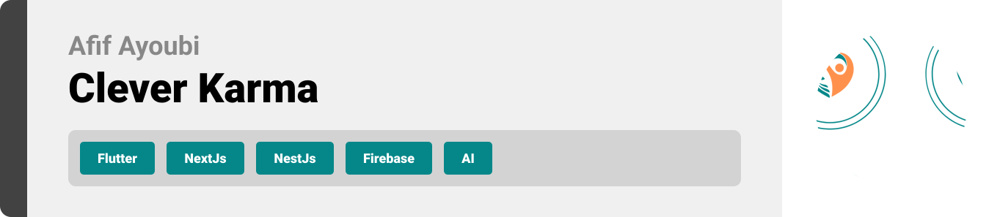

<br><br>

<!-- project philosophy -->


> A mobile app that connects passionate individuals with impactful volunteer opportunities. Forget endless searches and complicated applications. Discover causes you care about, explore relevant options, and take action - all with a few taps. Make a real difference in your community.
>
> Everyone can contribute. Our user-friendly platform connects you with causes you're passionate about, allowing you to find volunteer experiences that resonate and empower you to make a difference.

### User Stories

### Volunteer
- As a Volunteer, I want to receive notifications about upcoming volunteering events, fundraising campaigns, and advocacy initiatives from organizations I follow.
- As a Volunteer, I want to be able to easily access details about the organization, including their location and mission, to decide if it aligns with my interests.
- As a Volunteer, I want to be able to follow organizations to receive future notifications and easily join any live streams they host.

### Organization
- As an Organization, I want to access a comprehensive dashboard that includes real-time data visualizations from multiple sensors deployed in relevant locations (e.g., temperature, humidity, air quality).
- As an Organization, I want the platform to facilitate the sending of targeted notifications to relevant volunteers, outlining the situation and requesting their assistance.
- I want the ability to initiate live streams directly from the dashboard, showcasing the situation in real-time and further engaging potential volunteers who might be geographically dispersed.

### Admin
- As an Admin, I want to have a comprehensive user management system that allows me to send notifications to all users.
- As an Admin, I want the ability to create dedicated sections within the app for specific types of organizations.
- As an Admin, I want to integrate OpenAI capabilities within the platform for functionalities like predicting blood donation needs.

<br><br>

<!-- Tech stack -->


### Clever Karma is built using the following technologies:

- This project uses the [Flutter app development framework](https://flutter.dev/). Flutter is a cross-platform hybrid app development platform which allows us to use a single codebase for apps on mobile, desktop, and the web.
- For persistent storage (database), the app uses the [Hive](https://hivedb.dev/) package which allows the app to create a custom storage schema and save it to a local database.
   - 🚨 Currently, we're working on extending it to cover the entire app!
- To send  notifications, the app uses the [flutter_local_notifications](https://pub.dev/packages/flutter_local_notifications) with [firebase_messaging](https://pub.dev/packages/firebase_messaging) packages which supports Android, iOS, and macOS.
- The app provides accessibility to start and join live streaming using the [zego_uikit_prebuilt_live_streaming package](https://pub.dev/packages/zego_uikit_prebuilt_live_streaming). This package facilitates seamless integration for live streaming functionalities.
- Our app brings geographical contexts to life using the [Google Maps SDK](https://developers.google.com/maps/documentation). This integration allows us to display detailed maps, complete with interactive markers for each destination.
- This Project uses NestJs(https://docs.nestjs.com) framework for backend, NestJS is a progressive Node.js framework for building efficient, reliable, and scalable server-side applications. It leverages TypeScript and brings powerful features such as dependency injection, routing, middleware, and more, making it ideal for enterprise-grade development and API integration.
- To enhance user engagement, our app integrates an advanced [OpenAI](https://platform.openai.com/docs/introduction) endpoint powered by the GPT-3.5-turbo-instruct model. This AI-driven feature predicts the most needed type of blood, delivering valuable insights to administrators, who can then notify users via notifications.
- This project integrates data visualization through IoT using [Esp32](https://en.wikipedia.org/wiki/ESP32). Sensor data is sent in real-time to Firebase using [Real Time DB](https://firebase.google.com/docs/database), and it is integrated with Flutter using [firebase_database](https://pub.dev/packages/firebase_database) package to display graphical representations


<br><br>

<!-- UI UX -->


> We designed Clever Karma using wireframes and mockups, iterating on the design until we reached the ideal layout for easy navigation and a seamless user experience.

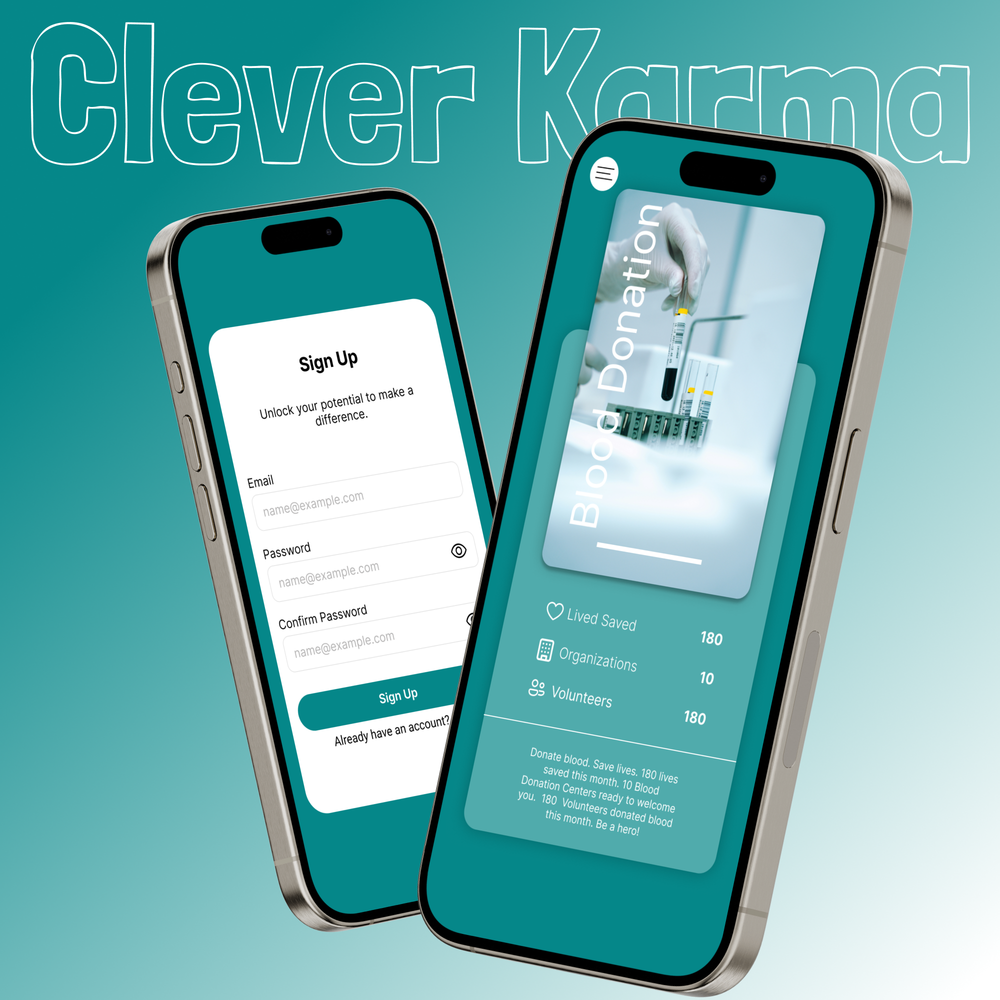

- Project Figma design [figma](https://www.figma.com/file/LsuOx5Wnh5YTGSEtrgvz4l/Purrfect-Pals?type=design&node-id=257%3A79&mode=design&t=adzbABt5hbb91ucZ-1)

### Mockups

| SignUp screen                             | Home Screen                           | OnBoarding Screen                          |
| --------------------------------------- | ------------------------------------- | ------------------------------------- |
| 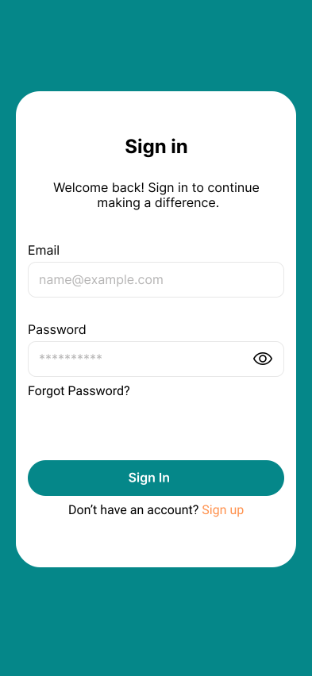 |  |  |

<br><br>

<!-- Database Design -->


### Architecting Data Excellence: Innovative Database Design Strategies:


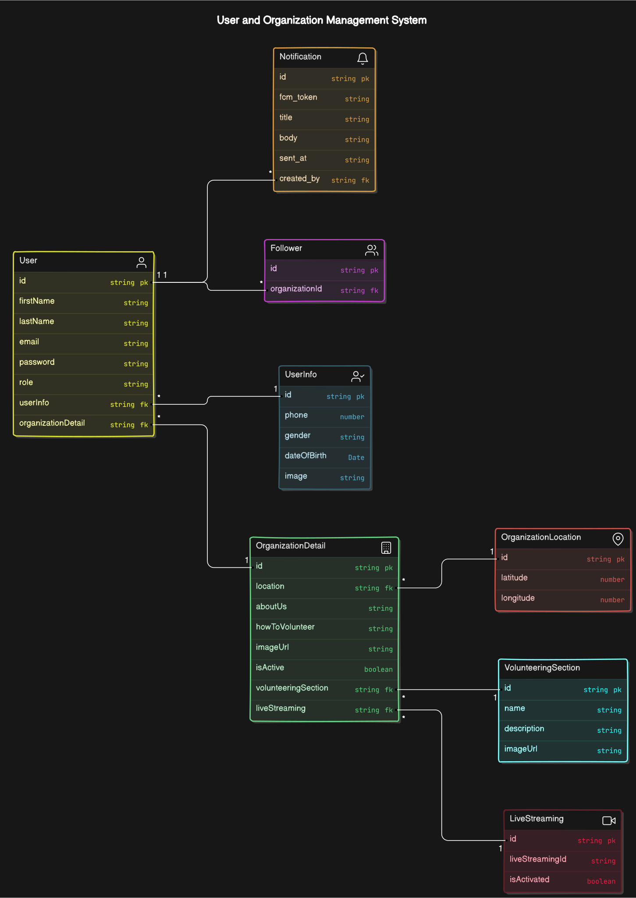


<br><br>

<!-- Implementation -->


### User Screens (Mobile)

| OnBoarding screen                              | Auth screens                         | Forgot Pass screen                          | Otp $ Change pass screen                          |
| ----------------------------------------- | --------------------------------------- | --------------------------------------- | --------------------------------------- |
|  |  | 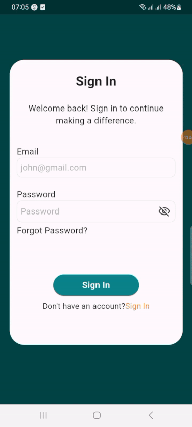 |  |
| Home screen                               | Organization Screen                             | Map Screen                            | Following Screen                         |
| 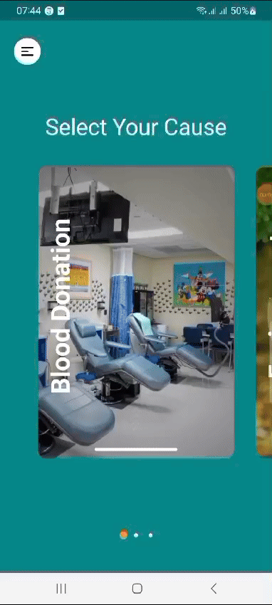 |  |  | 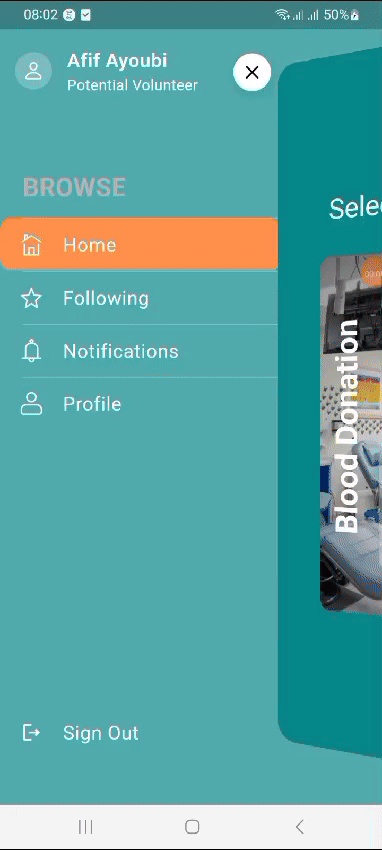 |
| Profile screen                               | Organization Screen                             | Organization Dashboard Screen                            | Organization Main Screen                         |
|  |  |  |  |

### Admin Screens (Web)

| info screen                            | Login screen                       | Dashboard screen                        |
| --------------------------------------- | ------------------------------------- | ------------------------------------- |
| 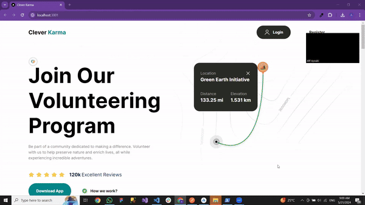 | 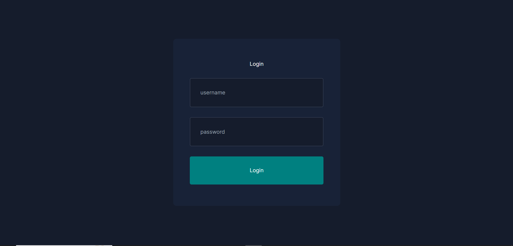 | 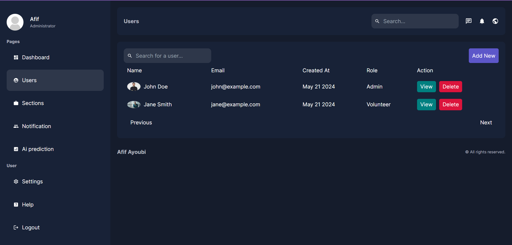 |
| Home screen                             | Menu Screen                           | Order Screen                          |
|  |  |  |

<br><br>

<!-- Prompt Engineering -->


### Mastering AI Interaction: Unveiling the Power of Prompt Engineering:

 
### User-Driven Keyword Extraction:
- The journey begins with a tailored questionnaire presented to our users. As they interact with these questions, their responses are meticulously analyzed to extract key phrases and words related to accident data.

### Seamless Prompt Formulation:
- Next, the extracted keywords are skillfully integrated into a carefully crafted prompt.

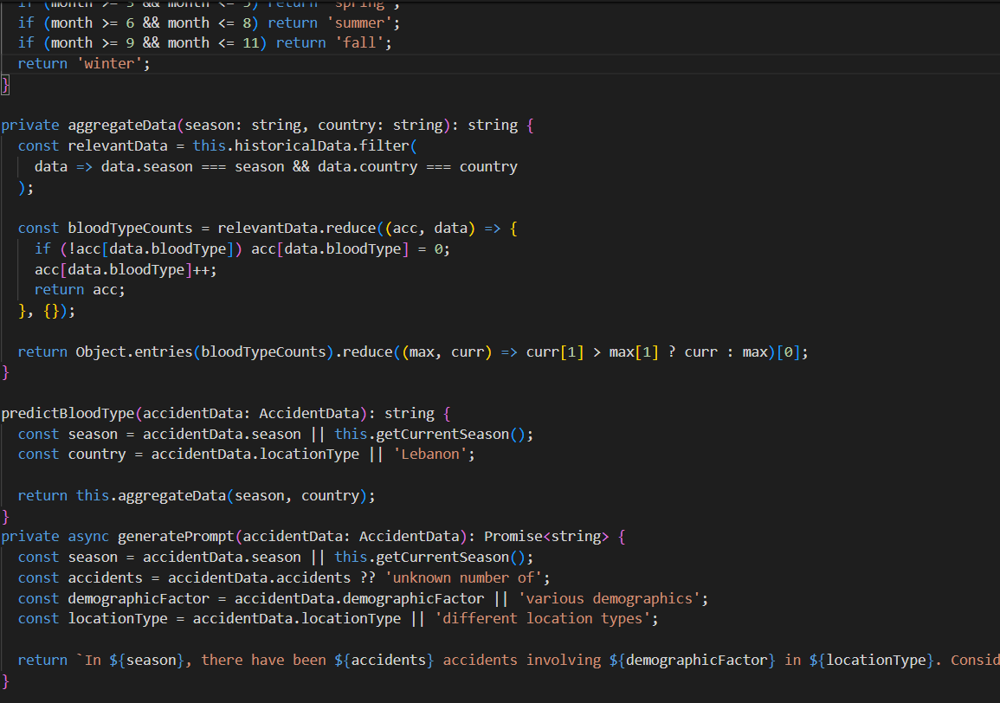
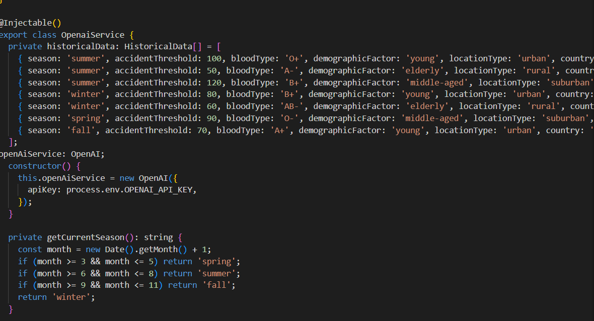

### Context-Aware Responses from AI:
- Once the prompt, enriched with the user's accident-related keywords, is fed into OpenAI's GPT model, the magic happens. The model processes the input, drawing from its vast knowledge base and the specific context provided. It then generates responses that are not just accurate but also tailored to the user's query.

### Location and Data Integration:
- What sets our application apart is how these AI-generated responses are seamlessly integrated with location-specific data and other relevant information from our app's database. For instance, our historical data includes accident thresholds categorized by season, demographic factors, and location types, enabling precise predictions and recommendations.


<br><br>

<!-- AWS Deployment -->


### Efficient AI Deployment: Unleashing the Potential with AWS Integration:

- This project leverages AWS deployment strategies to seamlessly integrate and deploy natural language processing models. With a focus on scalability, reliability, and performance, we ensure that AI applications powered by these models deliver robust and responsive solutions for diverse use cases.

### AWS Deployment Steps

1. Clone the Repository:
    - SSH into your EC2 instance.Clone the Repository.
    - Clone the repository using Git:
      ```sh
      https://github.com/afif-ayoubi/Clever-Karma.git
      ```
2. Create Docker Image:
    - Navigate to the backend directory where the Dockerfile is located:
         ```sh
         cd Clever-Karma/backend
         ```
    - Ensure that your Dockerfile is correctly defined to set up the Docker image.

3. Build and Run Docker Image:
    - Build the Docker image using the docker build command:
         ```sh
         docker build -t cue-backend 
         ```
    - Run the Docker container, mapping the appropriate ports (80 for HTTP, 443 for HTTPS):
         ```sh
         docker run -d -p 80:80 -p 443:443 cue-backend
         ```
### Notes:
- Docker Installation: Docker must be installed and running on your EC2 instance. You can install Docker using:
      ```sh
      sudo apt-get update
      sudo apt-get install docker.io
      ```
  


<br><br>


### Precision in Development: Harnessing the Power of Unit Testing:

- This project employs rigorous unit testing methodologies to ensure the reliability and accuracy of code components. By systematically evaluating individual units of the software, we guarantee a robust foundation, identifying and addressing potential issues early in the development process.

<br><br>

<!-- How to run -->


> To set up Clever Karma Express locally, follow these steps:

### Prerequisites

This is an example of how to list things you need to use the software and how to install them.

1. Install [FLutter SDK](https://docs.flutter.dev/release/archive?tab=windows) and Add it to your PATH.
2. Install [Node & NPM](https://nodejs.org/en/download/package-manager)
3. Install [Arduino IDE](https://www.arduino.cc/en/software)

### Installation

_Below is an example of how you can instruct your audience on installing and setting up your app. This template doesn't rely on any external dependencies or services._
### Website (NextJs) 

1. Clone the repo
   git clone [github](https://github.com/afif-ayoubi/Clever-Karma/tree/main?tab=readme-ov-file)

2. Navigate to the website directory  
    ```sh
   cd website
   ```
3. Run the following command to install the dependencies listed in package.json:
    ```sh
   npm install 
   ```
4. Run the following command to to run the project:
    ```sh
   npm run dev
   ```
### Mobile (Flutter)

1. Navigate to the mobile directory
   ```sh
   cd mobile
   ```
2. Run the following command to get all the required dependencies:
   ```sh
   flutter pub get
   ```
3. Run the project
   ```sh
   flutter run
   ```
### Backend (NestJs)

1. Navigate to the Backend directory
   ```sh
   cd backend
   ```
2. Install the dependencies:
   ```sh
   npm install
   ```
3. Run the project
   ```sh
   npm run start:dev
   ```
### Iot (Esp32)

1. Add ESP32 Board Manager URL:
   - Go to File > Preferences.
   ```sh
   cd backend
   ```
2. Install ESP32 Board Package:
    - Go to Tools > Board > Boards Manager....
    - Search for "esp32" and install "ESP32 by Espressif Systems".

3. Go to Tools > Board and select your ESP32 board from the list

4. Select Upload Speed and Port:
    - Go to Tools > Upload Speed and select the appropriate baud rate (usually 115200).


Now, you should be able to run Clever Karma  locally and explore its features.
